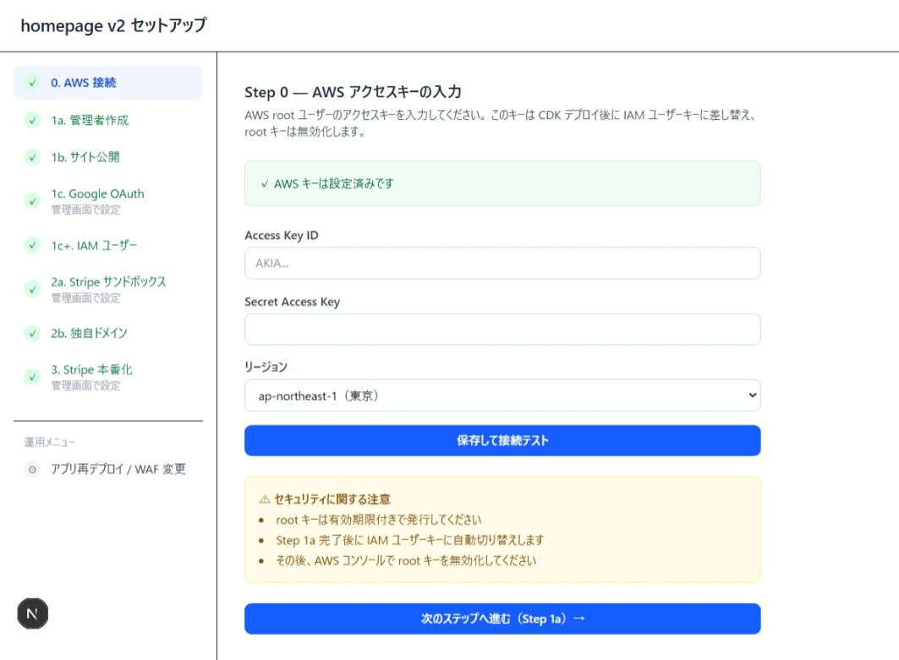
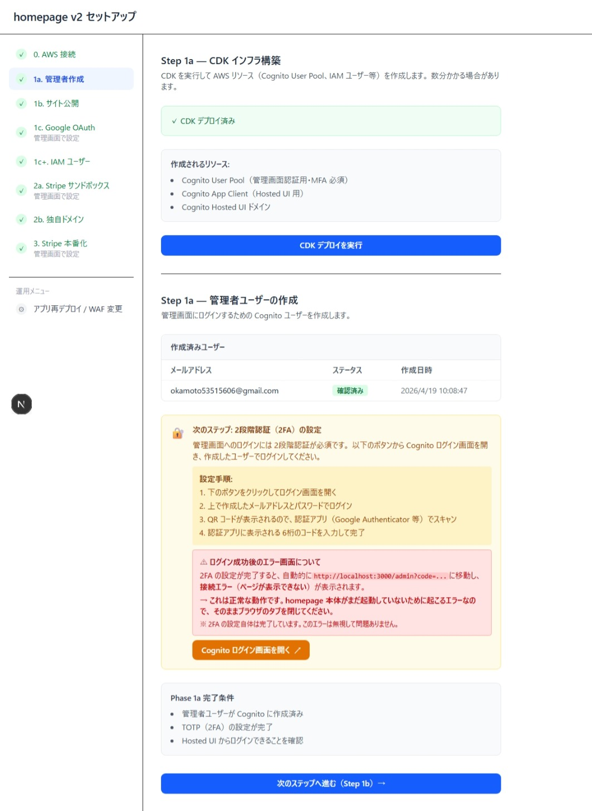
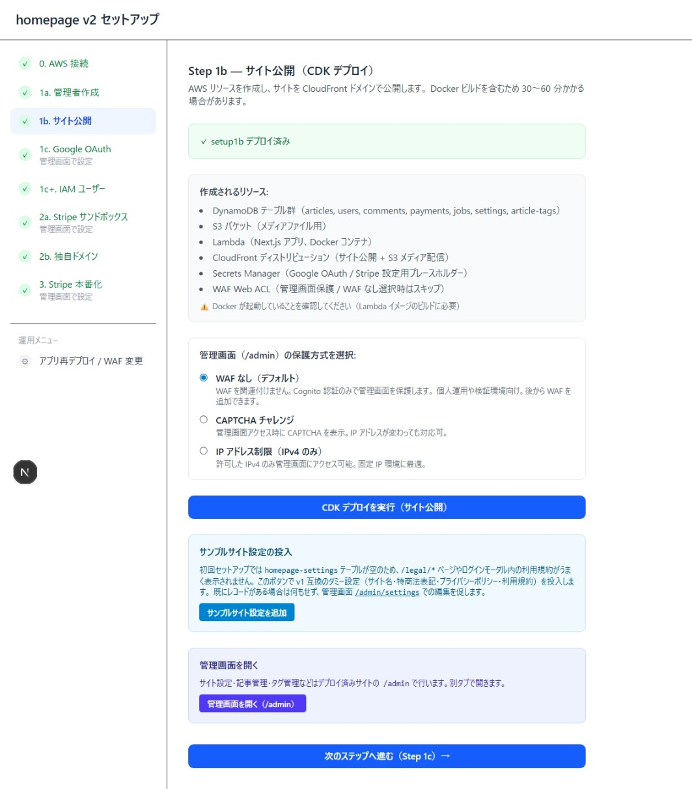
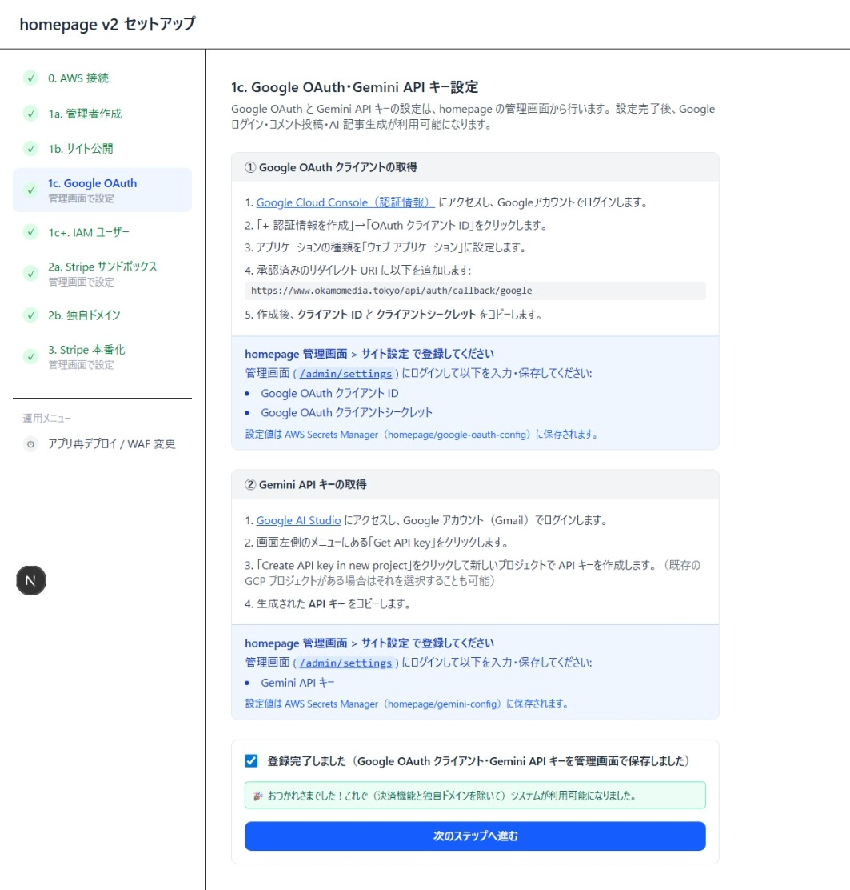
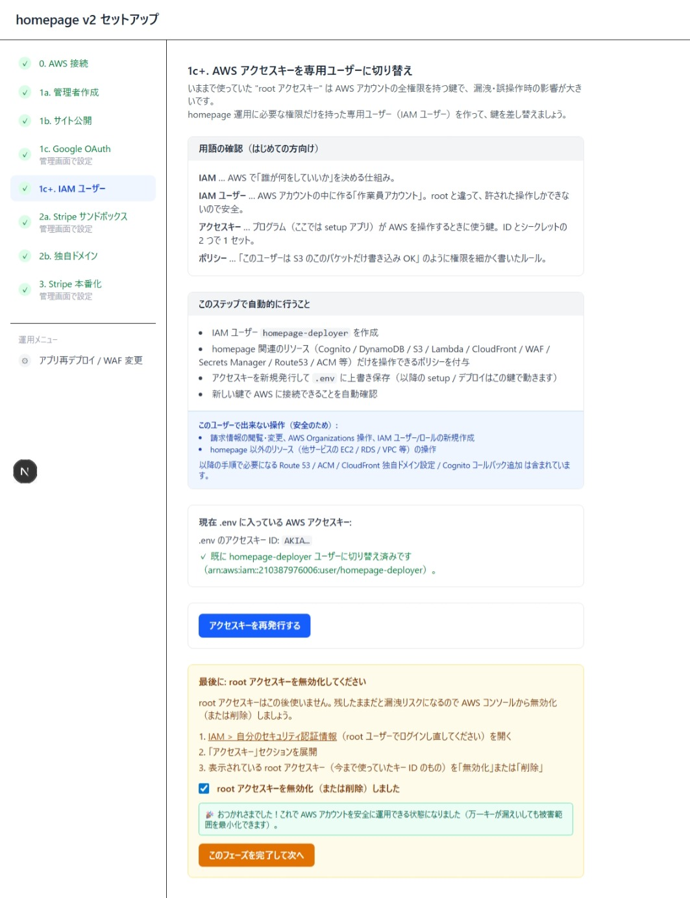

# homepage v2 セットアップ手順書 Part 1 — サイト公開まで

> **このパートのゴール:** AWS アカウントを準備し、CloudFront ドメイン（`xxx.cloudfront.net`）でサイトと管理画面を公開する。Google ログイン・記事生成 AI（Gemini）も利用可能になる状態まで進める。

セットアップ画面は配布用 WSL イメージを起動すると `http://localhost:3001` で開きます。下記「事前準備」でインストーラからセットアップ画面を起動してから Step 0 以降に進んでください。

---

## 事前準備 — homepage-v2-installer でセットアップ画面を起動する

非エンジニアでも GUI で WSL2 イメージのダウンロード・取り込み・起動・停止が完結できる Windows 用インストーラを配布しています。

### インストーラの動作環境

| 項目 | 要件 |
|---|---|
| OS | Windows 11（64bit） |
| CPU | x64（仮想化支援機能が有効） |
| メモリ | 8 GB 以上推奨（4 GB でも可。WSL2 による追加消費あり） |
| ディスク空き | 10 GB 以上（DL 中約 1.5 GB、VHDX 展開後数 GB） |
| WSL2 | インストーラが自動でセットアップする（未インストール環境でも OK） |
| ネットワーク | GitHub Releases へアクセス可能（初回のみ。以降はオフラインで起動可） |
| ポート | TCP `3001` がローカルで利用可能であること |
| 権限 | 一般ユーザーで OK（管理者権限不要） |

> **インストール先（参考）:** `%LOCALAPPDATA%\HomepageV2`（`app\` 実行ファイル / `wsl\` VHDX / `cache\` DL 中の一時 / `logs\` ログ）。WSL ディストリ名は `homepage-v2-latest`。

### 1. インストール

1. [Releases ページ](https://github.com/okamoto53515606/homepage-v2-installer/releases/latest) から `homepage-v2-installer-setup.zip` をダウンロード。
2. zipを解凍し、exeファイルをダブルクリックで起動。
3. **Windows SmartScreen** が「認識されないアプリ」と警告したら → **「詳細情報」** → **「実行」** をクリック。
4. ウィザードに従って「次へ」を進める。
   - 初回は WSL2 イメージ（約 1.1 GB / gzip 圧縮済み）をダウンロード（回線速度により数分〜数十分）。
   - SHA256 検証後、`wsl --import` で取り込み。
5. インストール完了と同時にタスクトレイにアイコンが常駐。

### 2. 起動 / 停止

1. タスクトレイの `homepage-v2-installer` アイコンを **右クリック**。
2. **「起動 (npm run dev)」** を選択。
3. 数十秒待つと自動でブラウザが開き、セットアップ画面（`http://localhost:3001`）が表示される。

セットアップ画面が表示されたら、以下の Step 0 から作業を始めてください。停止・アンインストール・トラブルシューティング等のインストーラ自体の操作は [homepage-v2-installer リポジトリ](https://github.com/okamoto53515606/homepage-v2-installer) を参照してください。

---

## 全体像

| Step | 画面 | 何をやるか | 担当ツール |
|---|---|---|---|
| 0 | `/setup0` | AWS アクセスキー登録 | setup |
| 1a | `/setup1a` | Cognito 構築 + 管理者ユーザー作成 + 2FA | setup |
| 1b | `/setup1b` | CDK でサイト本体をデプロイ（CloudFront 公開） | setup |
| 1c | `/setup1c` | Google OAuth クライアント + Gemini API キー登録 | 管理画面 |
| 1c+ | `/setup1c-iam` | root キーを IAM ユーザーキーに切り替え | setup |

---

## 進めるときの共通ルール

1. **左サイドバーで押せるリンクは「進めるところまで」** です。完了済みは緑チェック、現在地は青、ロック中はグレーアウト。グレーは前のステップが完了するまで開きません。
2. **完了したのに次のステップがグレーのまま** のときは、**ブラウザをリロード**（F5）すれば押せるようになります。
   > **why:** Next.js 16 のキャッシュ仕様で、進捗 API のレスポンスがブラウザに残ることがあります。修正済み（v2.0.x 以降）ですが、念のため知っておいてください。
3. **作業値は WSL 内 `~/homepage/setup/setup-state.json` に保存** されます。WSL を停止しても続きから再開できます。

---

## Step 0 — AWS アクセスキーの入力

### 事前準備（AWS コンソール側）

1. AWS マネジメントコンソールに **root ユーザー** でログイン。
2. 画面右上のアカウント名 → **「セキュリティ認証情報」** を開く。
3. **「アクセスキー」** セクションで **「アクセスキーを作成」** を実行。
4. 表示された **Access Key ID** と **Secret Access Key** をメモ（画面を閉じると Secret は二度と見られません）。

> **why:** v2 はインストール時のみ root キーを使い、Step 1c+ で **権限を絞った IAM ユーザーキーに自動で差し替え** ます。root キーは Step 1c+ 完了後に無効化するので、有効期限付きで発行する必要はありません。

### 画面操作

1. **Access Key ID / Secret Access Key** を貼り付け。
2. **リージョン** は **`ap-northeast-1（東京）`** 固定（v2 では東京のみ動作確認済み）。
3. **「保存して接続テスト」** をクリック → 緑のチェック「✓ AWS キーは設定済みです」が出れば OK。
4. **「次のステップへ進む（Step 1a）→」** で進む。

---

## Step 1a — 管理者ユーザーの作成

このステップでは **2 段階に分かれている** ので順に進めます。

### A. CDK で Cognito を構築

「**CDK デプロイを実行**」ボタンを押す。1〜3 分で「✓ CDK デプロイ済み」になります。
作成されるのは:
- Cognito User Pool（管理画面認証用、MFA 必須）
- Cognito App Client（Hosted UI 用）
- Cognito Hosted UI ドメイン

### B. 管理者ユーザーの作成

1. 「**管理者ユーザーの作成**」フォームに **メールアドレス** と **パスワード（8 文字以上）** を入力。
2. **「管理者ユーザーを作成」** をクリック。「作成済みユーザー」テーブルに行が増えれば成功。

### C. 2 段階認証（TOTP）の設定

1. ユーザー作成後に表示される **「Cognito ログイン画面を開く ↗」** ボタンをクリック。
2. 別タブで Cognito Hosted UI が開くので、作成したメール・パスワードでログイン。
3. **QR コード** が表示されるので、スマホの認証アプリ（Google Authenticator / Authy 等）でスキャン。
4. アプリに表示される 6 桁コードを入力 → 完了。

> **想定どおりの「エラー画面」について:**
> 2FA 設定が完了すると `http://localhost:3000/api/admin/auth/callback?code=...` に自動遷移して **「接続できません」** エラーが出ますが、**これは正常です**（homepage 本体はまだ未起動）。タブを閉じて Step 1b に進んでください。

戻ってきたら **「次のステップへ進む（Step 1b）→」** をクリック。

---

## Step 1b — サイト公開（CDK デプロイ）

このステップは **時間がかかります（30〜60 分）**。Lambda 用の Docker イメージビルドが含まれるためです。

### 事前確認

- WSL 内で **Docker daemon が起動している** こと（`docker info` が成功すること）。
- WSL の **DNS が正常に引ける** こと（`getaddrinfo ENOTFOUND` が出る場合は再実行で大抵直ります。）

### 画面操作

1. **管理画面（`/admin`）の保護方式** を選択:
   - **WAF なし（デフォルト）** — 個人運用や検証ならこれで OK。月額 $0。
   - **CAPTCHA チャレンジ** — 公開メディア向け。月額 $5 程度。
   - **IP アドレス制限（IPv4 のみ）** — 固定 IP 環境向け。月額 $5 程度。
2. **「CDK デプロイを実行（サイト公開）」** をクリック。完了まで放置。
3. 「✓ setup1b デプロイ済み」になったら **「サンプルサイト設定を追加」** をクリック。
   > **why:** 初回はサイト名・特商法・プライバシーポリシー・利用規約のレコードが空なので、ログインモーダルやフッターのリンクが崩れます。v1 互換のダミー設定を投入してから管理画面で本物の値に上書きする運用にしています。
4. **「管理画面を開く（/admin）」** をクリックして CloudFront ドメインの管理画面に遷移。Cognito ログイン画面が出るので Step 1a で作ったユーザー + TOTP でログイン。

戻ってきて **「次のステップへ進む（Step 1c）→」**。次のステップがグレーアウトのままなら **ブラウザをリロード** してください。

---

## Step 1c — Google OAuth・Gemini API キー設定

このステップは **homepage 本体の管理画面で設定** します。setup 画面は手順の案内とチェックボックスだけです。

### ① Google OAuth クライアントの取得

1. [Google Cloud Console（認証情報）](https://console.cloud.google.com/apis/credentials) にアクセス。
2. **「+ 認証情報を作成」 → 「OAuth クライアント ID」**。
3. アプリケーションの種類を **「ウェブ アプリケーション」** に。
4. **承認済みのリダイレクト URI** に setup 画面に表示されている URL（`https://<CloudFront ドメイン>/api/auth/callback/google`）をコピペで追加。
5. 作成後、**クライアント ID** と **クライアントシークレット** をコピー。

### ② Gemini API キーの取得

1. [Google AI Studio](https://aistudio.google.com/app/apikey) にアクセス。
2. 左メニュー **「Get API key」 → 「Create API key in new project」**。
3. 生成された **API キー** をコピー。

### ③ homepage 管理画面で登録

CloudFront ドメインの **`/admin/settings`** にログインして以下を入力 → **「保存」**:
- Google OAuth クライアント ID
- Google OAuth クライアントシークレット
- Gemini API キー

> **保存先:** Google OAuth は AWS Secrets Manager の `homepage/google-oauth-config`、Gemini は `homepage/gemini-config` に格納されます。

### ④ 完了マーク

setup 画面に戻り、**「登録完了しました」チェックボックスを ON** → **「次のステップへ進む」**。

---

## Step 1c+ — IAM ユーザーへの切り替え + root キー無効化

ここまで Step 0 で入力した **root アクセスキー** で動いていたので、**最小権限の専用ユーザーキー** に差し替えてリスクを下げます。

### A. アクセスキーの差し替え（自動）

**「アクセスキーを再発行する」** をクリック。setup 画面が以下を自動で実行します:
- IAM ユーザー `homepage-deployer` を作成（既存ならスキップ）
- homepage 関連リソースだけ操作できるポリシーを付与
- 新キーを発行 → `.env` を上書き
- 新キーで AWS 接続できることを確認

### B. root アクセスキーの無効化（手動）

> **why:** 自動化できない理由は、root キー無効化の API 自体に root 認証が要るからです。手動で 30 秒の作業をお願いします。

1. AWS コンソールに **root ユーザーで再ログイン**。
2. 画面右上 **「セキュリティ認証情報」** を開く。
3. **「アクセスキー」** セクションを展開。
4. 表示されている root のキー ID（Step 0 で発行したもの）を **「無効化」または「削除」**。
5. setup 画面に戻り **「root アクセスキーを無効化（または削除）しました」** をチェック → **「このフェーズを完了して次へ」**。

> ここまでで **サイトとしては利用可能** です。Stripe 決済と独自ドメインが要らなければ、ここで作業を切り上げて Part 2 / Part 3 を後日進めても大丈夫です。

次は [Part 2 — Stripe サンドボックス + 独自ドメイン](./setup2.md)。
