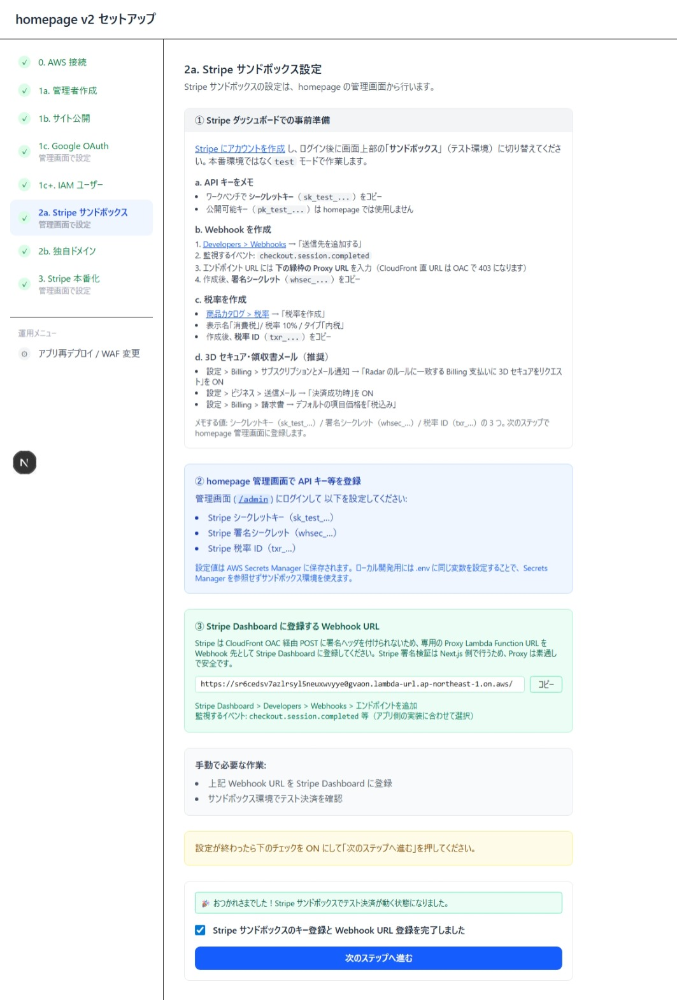
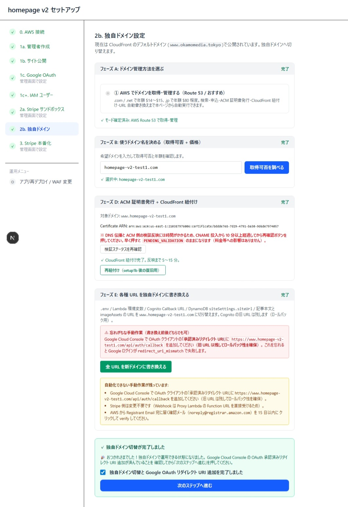

# homepage v2 セットアップ手順書 Part 2 — Stripe サンドボックス + 独自ドメイン

> **このパートのゴール:**
> 1. **Stripe サンドボックス** で有料記事の決済をテストできる状態にする。
> 2. **AWS Route 53 で独自ドメインを新規取得** し、CloudFront に紐付けて `https://www.example.com/` でサイトを公開する。
>
> Stripe **本番化**（実カード課金）は [Part 3](./setup3.md) で行います。

Part 1（[docs/setup1.md](./setup1.md)）が完了している前提です。

---

## Step 2a — Stripe サンドボックス設定



このステップも homepage **管理画面で設定** します。setup 画面は手順案内 + Webhook URL のコピペ用です。

### ① Stripe ダッシュボードでの事前準備

#### a. Stripe アカウント作成・サンドボックス切替

1. [Stripe](https://dashboard.stripe.com/register) でアカウントを作成（個人事業主でも可）。
2. ログイン後、画面上部のセレクタを **「サンドボックス」（test モード）** に切替。
   > **why:** 本番（live）モードで作業すると審査が必要・実カード課金が走るリスクがあるため、まずは test モードで動作確認。

#### b. API キーをメモ

**ワークベンチ → API キー** から **シークレットキー（`sk_test_...`）** をコピー。
（公開可能キー `pk_test_...` は homepage では使いません）

#### c. Webhook を作成

1. **Developers → Webhooks → 「送信先を追加する」**。
2. 監視するイベント: **`checkout.session.completed`**
3. エンドポイント URL には setup 画面下部に表示されている **Proxy Lambda Function URL** を **そのまま** 貼り付け。
   > **why:** Stripe の Webhook ヘッダは CloudFront OAC 経由だと SigV4 署名が合わずに 403 になるため、専用の Proxy Lambda（AuthType: NONE）を経由します。CloudFront ドメイン直 URL を入れると必ず失敗します。
4. 作成後、**署名シークレット（`whsec_...`）** をコピー。

#### d. 税率を作成

1. **商品カタログ → 税率 → 「税率を作成」**。
2. 表示名「消費税」/ 税率 10% / タイプ「内税」。
3. 作成後、**税率 ID（`txr_...`）** をコピー。

#### e. 3D セキュア・領収書メール（推奨）

- **設定 → Billing → サブスクリプションとメール通知** → 「Radar のルールに一致する Billing 支払いに 3D セキュアをリクエスト」を **ON**。
- **設定 → ビジネス → 送信メール** → 「決済成功時」を **ON**。
- **設定 → Billing → 請求書** → デフォルトの項目価格を **「税込み」**。

メモする値は **シークレットキー** / **署名シークレット** / **税率 ID** の **3 つ**。

### ② homepage 管理画面で登録

CloudFront ドメインの **`/admin/settings`** にログインして以下を保存:
- Stripe シークレットキー（`sk_test_...`）
- Stripe 署名シークレット（`whsec_...`）
- Stripe 税率 ID（`txr_...`）

### ③ サンドボックスでテスト決済

- 有料記事を作成 → ログイン状態で「購入する」をクリック。
- Stripe テストカード `4242 4242 4242 4242` / 任意の将来日 / 任意の CVC で決済。
- 成功画面が表示され、Stripe Dashboard の「支払い」に test 取引が出ていれば OK。

setup 画面に戻り **チェックボックスを ON** → **「次のステップへ進む」**。

---

## Step 2b — 独自ドメイン設定（Route 53 で新規取得）



> ここでは **AWS Route 53 でドメインを新規取得** するルートを説明します。すでに他社（お名前.com 等）でドメインを持っている場合の手順は別ルートになります（setup 画面で「外部 DNS」を選ぶと案内が変わります）。

このステップは **A → B → D → E** の 4 フェーズに分かれています（C は外部 DNS ルート専用なのでスキップ）。

### フェーズ A — ドメイン管理方法を選ぶ

1. **「① AWS でドメインを取得・管理する（Route 53 / おすすめ）」** を選択。
2. 「✓ モード確定済み: AWS Route 53 で取得・管理」が表示されればフェーズ A 完了。

> **why:** Route 53 を選ぶと、ドメイン購入・DNS レコード作成・ACM 証明書発行・CloudFront alias 紐付けまで setup 画面が自動で実行できます。`.com` / `.net` で年額 $14〜$15、`.jp` で年額 $80 程度。

### フェーズ B — 使うドメイン名を決める

1. **希望ドメイン**（例: `homepage-v2-test1.com`）を入力 → **「取得可否を調べる」**。
2. 取得可能なら緑のチェック。**この時点ではまだ購入していません**。
3. 取得不可なら別の名前を試してください。

ドメイン購入の確認ダイアログが続いて表示されるので、**年額・自動更新・登録者情報** を確認のうえ承認します。

> ⚠️ **AWS から `noreply@registrar.amazon.com` 宛に確認メール** が届くので、**15 日以内に verify リンクをクリック** してください。verify しないとドメインがサスペンドされます。

### フェーズ D — ACM 証明書発行 + CloudFront 紐付け

1. setup 画面が自動で:
   - `us-east-1` に ACM 証明書をリクエスト（`www.<ドメイン>`）
   - Route 53 ホストゾーンに DNS 検証用 CNAME を投入
   - 検証完了後に CloudFront のエイリアスとして紐付け
2. **「DNS 伝播と ACM 検証反映には時間がかかる」** ため、CNAME 投入から **10 分以上** 待ってから **「検証ステータスを再確認」** をクリック。早く押すと `PENDING_VALIDATION` のままになります（料金等への影響はなし）。
3. 「✓ CloudFront 紐付け完了。反映まで 5〜15 分」になればフェーズ D 完了。

### フェーズ E — 各種 URL を独自ドメインに書き換え

ここで **CloudFront ドメイン → 独自ドメイン** へ書き換える対象は以下:
- `.env` / Lambda 環境変数
- Cognito Callback URL（旧 URL は残して **ロールバック性を確保**）
- DynamoDB `siteSettings.siteUrl`
- 記事本文と imageAssets テーブルの URL

1. **「全 URL を新ドメインに書き換える」** をクリック。
2. 書き換え後（**前後どちらでも可**）、以下の手動作業を **必ず実施**:

   #### 手動作業 1: Google OAuth リダイレクト URI の追加 ⚠️
   
   [Google Cloud Console](https://console.cloud.google.com/apis/credentials) の OAuth クライアント設定で、**承認済みのリダイレクト URI** に新ドメイン版を **追加**:
   ```
   https://www.<新ドメイン>/api/auth/callback
   ```
   > **why:** 旧 CloudFront ドメインの URI は **削除せず残す** ことで、書き換えに失敗しても旧 URL でロールバックできるようにしています。これを忘れると Google ログインが `redirect_uri_mismatch` で失敗します。

   #### 手動作業 2: Stripe 側は変更不要
   
   Webhook は Proxy Lambda Function URL を直接受けているので、ドメイン切替の影響を受けません。

   #### 手動作業 3: AWS Registrant Email の verify
   
   フェーズ B の項を参照（`noreply@registrar.amazon.com` のリンクを 15 日以内にクリック）。

3. setup 画面の **「独自ドメイン切替と Google OAuth リダイレクト URI 追加を完了しました」** をチェック → **「次のステップへ進む」**。

---

## つまずいたときの一般的な対処

| 症状 | 対処 |
|---|---|
| 完了したのに次のステップがグレーアウトのまま | ブラウザをリロード（F5） |
| ACM 検証が `PENDING_VALIDATION` のまま | DNS 伝播待ち。10 分以上待ってから「検証ステータスを再確認」 |
| 独自ドメインで Google ログインが失敗 | Google Cloud Console の OAuth クライアントに新ドメインのリダイレクト URI を追加し忘れ |
| 独自ドメインで「接続できません」 | CloudFront 反映待ち（5〜15 分）。それでも直らなければ ACM 紐付けを「再紐付け」ボタンで修復 |

次は [Part 3 — Stripe 本番化](./setup3.md)。
