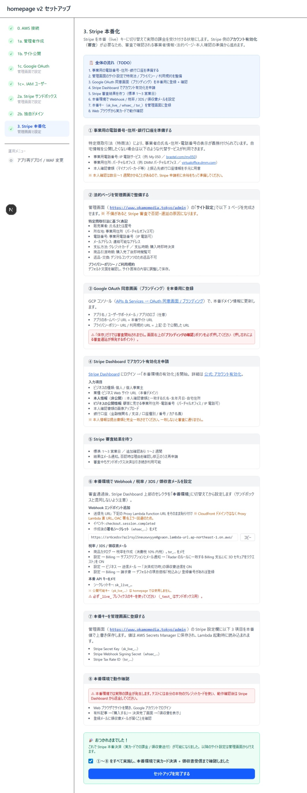

# homepage v2 セットアップ手順書 Part 3 — Stripe 本番化

> **このパートのゴール:** Stripe を **本番（live）** モードに切り替え、**実カードでの課金** が走る状態にする。

[Part 2](./setup2.md) で **Stripe サンドボックス** + **独自ドメイン** が完了している前提です。

> ⚠️ **このパートは Stripe の審査（1〜3 営業日）が入る** ため、申請前に必要書類を揃えておくとスムーズです。

---

## 全体の流れ

1. 事業用の電話番号・住所・銀行口座を準備する
2. 管理画面のサイト設定で **特商法 / プライバシー / 利用規約** を整備する
3. **Google OAuth 同意画面（ブランディング）** を本番用に登録 + 確認
4. **Stripe Dashboard でアカウント有効化** を申請
5. Stripe 審査結果を待つ（標準 1〜3 営業日）
6. 本番環境で **Webhook / 税率 / 3DS / 領収書メール** を設定
7. 本番キー（`sk_live_` / `whsec_` / `txr_`）を管理画面に登録
8. Web ブラウザから実カードで動作確認

---

## ① 事業用の電話番号・住所・銀行口座を準備する

特定商取引法（特商法）により、ECサイト・有料コンテンツ販売者は **氏名・住所・電話番号の表示が義務** です。自宅情報を公開したくない場合は代替サービスが利用できます。

| 項目 | 自宅情報を出したくない場合の代替 |
|---|---|
| 電話番号 | IP 電話サービス（例: My 050 / [brastel.com/my050](https://www.brastel.com/my050)） |
| 住所 | バーチャルオフィス（例: DMM バーチャルオフィス [virtualoffice.dmm.com](https://virtualoffice.dmm.com/)） |
| 本人確認書類 | マイナンバーカード等と、**振込先銀行口座情報** |

> **why:** 本人確認は数日〜1 週間かかることがあるので、Stripe 申請前に余裕をもって準備してください。

---

## ② 法的ページを管理画面で整備する

独自ドメインの管理画面（例: `https://www.<ドメイン>/admin`）の **「サイト設定」** で以下 3 ページを完成させます。

> **why:** 不備があると Stripe 審査で否認・遅延の原因になります。サンプル設定（Step 1b で投入したダミー）のままでは確実に通りません。

### 特定商取引法に基づく表記

- 販売業者: 氏名または屋号
- 所在地: 事業用住所（バーチャルオフィス可）
- 電話番号: 事業用電話番号（IP 電話可）
- メールアドレス: 連絡可能なアドレス
- 支払方法: クレジットカード ／ 支払時期: 購入時即時決済
- 商品引渡時期: 購入完了後即時閲覧可
- 返品・交換: デジタルコンテンツのため返品不可

### プライバシーポリシー / 利用規約

デフォルト文面を確認のうえ、サイト固有の内容に調整して保存。

---

## ③ Google OAuth 同意画面（ブランディング）を本番用に登録

[Google Cloud Console — APIs & Services → OAuth 同意画面 / ブランディング](https://console.cloud.google.com/apis/credentials/consent) で本番ドメイン情報に更新します。

入力項目:
- アプリ名 / ユーザーサポートメール / アプリのロゴ（任意）
- アプリのホームページ URL = 本番サイト URL
- プライバシーポリシー URL / 利用規約 URL = 上記 ② で公開した URL

> ⚠️ **「保存」だけでは審査開始されません。** 画面右上の **「ブランディングの確認」ボタン** を必ず押してください（押し忘れによる審査遅延が頻発するポイント）。

---

## ④ Stripe Dashboard でアカウント有効化を申請

[Stripe Dashboard](https://dashboard.stripe.com/) にログインして **「本番環境の有効化」** を開始。詳細は [Stripe 公式: アカウント有効化](https://docs.stripe.com/get-started/account/activate-account) を参照。

入力項目:
- ビジネスの種類: 個人 / 個人事業主
- 業種・ビジネス Web サイト URL（本番ドメイン）
- 本人情報（非公開）: 本人確認書類と一致する氏名・生年月日・自宅住所
- ビジネスの公開情報: 顧客に見せる事業所住所・電話番号（バーチャルオフィス / IP 電話可）
- 本人確認書類の画像アップロード
- 銀行口座（金融機関名 / 支店 / 口座種別 / 番号 / カナ名義）

> ⚠️ **本人情報は提出書類と完全一致** させてください。一致しないと審査に通りません。

---

## ⑤ Stripe 審査結果を待つ

- 標準: 1〜3 営業日 ／ 追加確認あり: 1〜2 週間
- 結果はメール通知。否認時は理由を確認し修正のうえ再申請。
- **審査中もサンドボックス決済は引き続き利用可能** です。

---

## ⑥ 本番環境で Webhook / 税率 / 3DS / 領収書メールを設定

審査通過後、Stripe Dashboard 上部のセレクタを **「本番環境」** に切替えてから設定します（サンドボックスと混同しないよう注意）。

### Webhook エンドポイント追加

- 送信先 URL: setup 画面下部の **Proxy Lambda Function URL** をそのまま貼り付け
  > ※ CloudFront ドメインではなく **Proxy Lambda 直 URL**。OAC 署名エラー回避のため。
- イベント: `checkout.session.completed`
- 作成後の **署名シークレット（`whsec_...`）** をメモ

### 税率 / 3DS / 領収書メール

- **商品カタログ → 税率を作成**（消費税 10% 内税）→ `txr_...` をメモ
- **設定 → Billing → サブスクリプションとメール通知** → 「Radar のルールに一致する Billing 支払いに 3D セキュアをリクエスト」を **ON**
- **設定 → ビジネス → 送信メール** → 「決済成功時」の領収書送信を **ON**
- **設定 → Billing → 請求書** → デフォルトの項目価格を **「税込み」**（登録番号があれば登録）

### 本番 API キーをメモ

- **シークレットキー: `sk_live_...`**
- 公開可能キー（`pk_live_...`）は homepage では使いません
- ⚠️ **必ず `_live_` プレフィックスのキー** を使用（`_test_` はサンドボックス用）

---

## ⑦ 本番キーを管理画面に登録する

独自ドメインの **`/admin`** の **Stripe 設定欄** に以下 3 項目を **本番値で上書き保存**:
- Stripe Secret Key（`sk_live_...`）
- Stripe Webhook Signing Secret（`whsec_...`）
- Stripe Tax Rate ID（`txr_...`）

> 値は AWS Secrets Manager に保存され、Lambda 起動時に読み込まれます。反映まで 1〜2 分かかることがあります。

---

## ⑧ 本番環境で動作確認

> ⚠️ **本番環境では実際の課金が発生します。** テストには **自分の本物のクレジットカード** を使い、動作確認後は Stripe Dashboard から返金してください。

1. Web ブラウザでサイトを開き、Google アカウントでログイン
2. 有料記事 → **「購入する」** → 決済完了画面 → **「領収書を表示」**
3. 登録メールに領収書メールが届くことを確認
4. Stripe Dashboard で本番取引が記録されていることを確認
5. **動作確認用の取引は Stripe Dashboard から返金**

---

## ⑨ 完了

setup 画面の **「①〜⑧ をすべて実施し、本番環境で実カード決済 + 領収書受信まで確認しました」** をチェック → **「セットアップを完了する」**。

🎉 おつかれさまでした。これで Stripe 本番決済（実カードでの課金 / 領収書送付）が可能になりました。以降のサイト設定・記事追加・タグ管理などは管理画面から行えます。

---

## 運用 TIPS

### 取引履歴や購入者の確認

homepage 管理画面には取引履歴の閲覧機能がないため、**Stripe 管理画面**で確認します。

#### 手順

1. Stripe ダッシュボードにログイン

   👉 https://dashboard.stripe.com/

2. 「**支払い**」または「**取引**」メニューから確認

#### 参考リンク

👉 https://support.stripe.com/express/questions/where-can-i-view-recent-payouts-and-transactions?locale=ja-JP

---

### クレーム対応で返金する場合

返金は Stripe 管理画面から行います。

#### 手順

1. Stripe ダッシュボードにログイン

   👉 https://dashboard.stripe.com/

2. 「**支払い**」から対象の取引を選択

3. 「**返金**」ボタンをクリック

4. 返金理由と金額を入力して実行

#### 参考リンク

👉 https://docs.stripe.com/refunds?locale=ja-JP

> **📌 返金のポイント**
>
> - 全額返金と一部返金が選択可能
> - 返金後、お客様には返金通知メールが届きます
> - Stripe の手数料は返金されません（注意）
